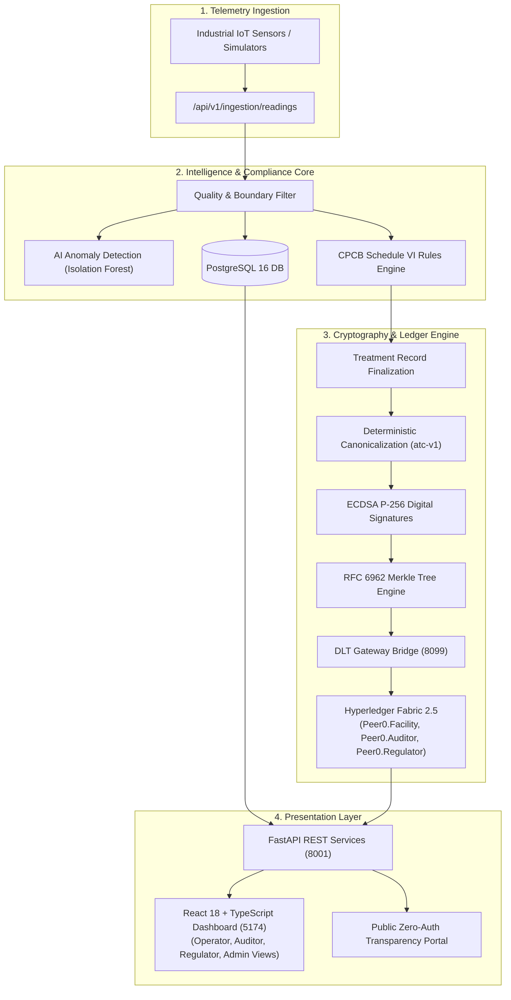

# IWM-BTS: Intelligent Wastewater Monitoring & Blockchain Traceability System

[](./AUDIT_REPORT.md)
[](https://fastapi.tiangolo.com)
[](https://react.dev)
[](https://www.typescriptlang.org)
[](https://www.hyperledger.org/use/fabric)
[](https://www.postgresql.org)
[](https://python.org)

**IWM-BTS** (formerly *AquaTrustAI*) is a production-grade industrial wastewater monitoring, environmental compliance, and cryptographic traceability platform. It bridges continuous IoT sensor telemetry, unsupervised AI anomaly detection, statutory CPCB compliance validation, RFC 6962 Merkle tree batching, and an immutable **Hyperledger Fabric 2.5** enterprise blockchain ledger.

---

## 🌟 Key Features & Capabilities

- 🌊 **Continuous IoT Telemetry Ingestion:** Ingests live effluent parameters (pH, BOD, COD, TSS, Oil & Grease) with deterministic out-of-bounds invalidation and future-timestamp rejection.
- 🧠 **AI Anomaly Detection (Isolation Forest):** Uses an in-memory sliding-window feature extractor (rolling mean, rolling std, rate of change $\Delta$, lag-1) and scikit-learn Isolation Forest (`iforest_v2.2.1`) to identify contamination surges and sensor faults in real time.
- 📜 **Statutory CPCB Compliance Engine:** Evaluates treatment batches against **Central Pollution Control Board (CPCB) Schedule VI General Discharge Standards** (BOD $\le 30 \text{ mg/L}$, COD $\le 250 \text{ mg/L}$, TSS $\le 100 \text{ mg/L}$, pH $5.5 - 9.0$).
- 🔐 **Mathematical Cryptographic Sealing:**
  - **Deterministic Canonicalization (`atc-v1`):** Prunes mutable fields and serializes parameters uniformly.
  - **ECDSA P-256 (ES256) Digital Signatures:** Seals batches with asymmetric keypairs.
  - **RFC 6962 Merkle Tree Audit Proofs:** Computes cryptographic proofs across batch windows.
- ⛓️ **Hyperledger Fabric 2.5 DLT:** Commits treatment certificates and anchor hashes across a 3-organization peer network (`Facility`, `Auditor`, `Regulator`) with Raft consensus. Rejects duplicate conflicting records at the endorsement level.
- 🔍 **4-Stage Independent Verification Pipeline:** Allows regulators, auditors, and the public to verify any treatment certificate across Local Hash, Digital Signature, Merkle Tree Root, and Fabric Ledger.
- 🛡️ **Append-Only Correction Lineage:** Prohibits destructive database mutations. Corrections are proposed by operators, audited by third parties, authorized, and linked as an immutable provenance chain (`superseded_by_correction`).
- 💻 **Modern Role-Based Frontend:** Responsive React 18 + TypeScript + Vite + Tailwind CSS dashboard with distinct RBAC experiences for Operators, Auditors, Regulators, and Administrators.

---

## 🏛️ System Architecture



---

## 🚀 Quick Start Guide

### Prerequisites
- **Python 3.10+** (tested up to 3.13)
- **Node.js 18+** & `npm`
- **PostgreSQL 14+** *(or standard Docker / SQLite fallback)*
- **Docker Desktop** *(optional; only required if running live Hyperledger Fabric containers)*

---

### Step 1: Clone the Repository
```bash
git clone https://github.com/Royce121005/AquaTrustAI.git
cd AquaTrustAI
git checkout valentino
```

---

### Step 2: Backend Setup

1. **Create and activate a Python virtual environment:**
   ```bash
   # Windows
   python -m venv .venv
   .venv\Scripts\activate

   # macOS / Linux
   python3 -m venv .venv
   source .venv/bin/activate
   ```

2. **Install Python dependencies:**
   ```bash
   pip install -r backend/requirements.txt -r datasets/requirements.txt
   ```

3. **Configure Database (Choose Option A, B, or C):**

   * **Option A — Docker PostgreSQL (Recommended):**
     ```bash
     docker run -d --name aquatrust-pg -p 5432:5432 \
       -e POSTGRES_USER=aquatrust_user \
       -e POSTGRES_PASSWORD=aquatrust_password \
       -e POSTGRES_DB=aquatrust_db \
       postgres:16
     ```

   * **Option B — Local PostgreSQL:**
     Ensure PostgreSQL is running on `localhost:5432` with database `aquatrust_db` owned by user `aquatrust_user` (password: `aquatrust_password`).

   * **Option C — Zero-Install SQLite Fallback:**
     Create a `.env` file inside `backend/`:
     ```env
     DATABASE_URL=sqlite:///./aquatrust.db
     ```

4. **Initialize and Seed the Database:**
   ```bash
   cd backend
   python -m app.db.init_db
   ```

5. **Start the FastAPI Backend:**
   ```bash
   uvicorn app.main:app --host 0.0.0.0 --port 8001 --reload
   ```
   - API Root: `http://localhost:8001`
   - Interactive Swagger Docs: `http://localhost:8001/docs`

> [!NOTE]
> **Hyperledger Fabric Mode:** If Docker or Fabric containers are not running, the backend automatically operates in **Simulation DLT Mode**, enabling all cryptographic workflows, Merkle trees, and verification checks out of the box. To launch the full 3-org Fabric network, run `docker compose up -d` in `dlt/network`.

---

### Step 3: Frontend Setup

In a new terminal window:

```bash
cd frontend
npm install

# Start the Vite development server
npm run dev
```

The application will be live at **`http://localhost:5173`** (or `http://localhost:5174`).

---

## 🔑 Pre-Seeded Demo Accounts

The database comes pre-seeded with distinct role accounts:

| Role | Email Address | Password | Permissions |
|---|---|---|---|
| **Facility Operator** | `operator@aquatrust.ai` | `Operator123!` | Ingest telemetry, finalize records, propose corrections |
| **Environmental Auditor** | `auditor@aquatrust.ai` | `Auditor123!` | Authorize corrections, inspect audit logs, review compliance |
| **Regulatory Officer** | `regulator@cpcb.gov.in` | `Regulator123!` | Read-only oversight, statutory compliance reports, ledger audits |
| **System Administrator** | `admin@aquatrust.ai` | `Admin123!` | User registration, facility setup, system status & simulator control |

---

## 🔬 Core REST API Routes

| HTTP Method | Route | Description | Auth Required |
|---|---|---|---|
| `POST` | `/api/v1/auth/login` | Authenticate user & issue signed JWT | Public |
| `POST` | `/api/v1/ingestion/readings` | Ingest sensor telemetry point with quality validation | Operator / Admin |
| `GET` | `/api/v1/readings` | Query historical sensor telemetry with stage filters | Authenticated |
| `GET` | `/api/v1/compliance/summary` | Real-time CPCB compliance summary metrics | Authenticated |
| `POST` | `/api/v1/compliance/evaluate` | Run statutory compliance evaluation on a record | Auditor / Regulator / Admin |
| `POST` | `/api/v1/treatment-records/finalize`| Cryptographically seal & anchor treatment batch | Operator / Admin |
| `POST` | `/api/v1/verification/verify-record/{id}` | Execute 4-stage independent cryptographic audit | Authenticated |
| `GET` | `/api/v1/verification/public/verify/{id}` | Public transparency zero-auth certificate verify | Public |
| `POST` | `/api/v1/corrections/propose` | Propose append-only correction for suspect reading | Operator / Auditor |
| `POST` | `/api/v1/corrections/{id}/authorize` | Authorize correction and anchor superseding record | Auditor / Admin |
| `GET` | `/api/v1/corrections/chain/{id}` | Traverses immutable append-only provenance chain | Authenticated |

---

## 🧪 Testing & Verification

The repository contains extensive, independently verified automated test suites across every layer:

```bash
# 1. Run Backend Core Test Suite (131 tests)
pytest backend/tests -v

# 2. Run Machine Learning & Dataset Invariant Tests (49 tests)
pytest datasets/tests -v

# 3. Run Hyperledger Fabric Chaincode Unit Tests (5 tests)
npm --prefix dlt/chaincode/aquatrust-records test

# 4. Run Frontend Invariant Unit Tests (15 tests)
npm --prefix frontend test

# 5. Build Frontend Production Distribution
npm --prefix frontend run build

# 6. Run End-to-End User Flow Test
python test_e2e_integration.py
```

### Complete Test Results Summary:
- **Total Test Cases Executed:** **251**
- **Passing Tests:** **251**
- **Failures:** **0**
- See the full 49-section [AUDIT_REPORT.md](AUDIT_REPORT.md) for complete details.

---

## 📁 Repository Directory Structure

```
AquaTrustAI/
├── backend/                  # FastAPI backend application
│   ├── app/
│   │   ├── api/v1/           # REST API route handlers
│   │   ├── core/             # Configuration & security settings
│   │   ├── crypto/           # Canonicalizer, ECDSA, & Merkle tree logic
│   │   ├── db/               # SQLAlchemy models & database session
│   │   ├── dlt/              # Hyperledger Fabric DLT gateway & bridge
│   │   ├── repositories/     # Database repository layer
│   │   ├── services/         # Business services (compliance, corrections, etc.)
│   │   └── simulator/        # ETP telemetry simulator engine
│   ├── tests/                # 131 backend pytest tests
│   └── requirements.txt      # Python dependencies
├── frontend/                 # React 18 + TypeScript + Vite application
│   ├── src/
│   │   ├── api/              # Axios client and API services
│   │   ├── components/       # UI components (Navbar, Sidebar, Modals)
│   │   ├── pages/            # Role dashboards, Trust verification, Records
│   │   ├── types/            # TypeScript domain interfaces
│   │   └── test/             # Vitest test suite
│   └── package.json          # Node.js dependencies & scripts
├── dlt/                      # Hyperledger Fabric resources
│   ├── chaincode/            # Go chaincode for aquatrust-records
│   └── network/              # Docker Compose network (Orderer + 3 Peer Orgs)
├── ml/                       # Machine learning inference engine
│   └── inference/            # Isolation Forest engine & feature caching
├── datasets/                 # Datasets, manifests & ML test suite
│   ├── tests/                # 49 ML pytest tests
│   └── manifests/            # Data processing manifests
├── AUDIT_REPORT.md           # Independent 49-section production readiness audit
└── README.md                 # Project documentation
```

---

## 📄 License & Attribution

This project is licensed under the **MIT License**.  
Developed for transparent, verifiable, and tamper-proof environmental compliance monitoring.
