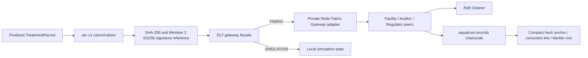

# AquaTrust DLT / Blockchain Layer

This package anchors finalized treatment evidence in Hyperledger Fabric. PostgreSQL remains the owner of the full record and Member 2's finalization/signature APIs remain authoritative. The ledger stores hashes, references, correction links, and batch commitments only.

## Repository audit and current boundary

Before implementation, the existing repository was inspected. Reused components are:

- `backend/app/dlt/canonicalizer.py` and `hasher.py`: the frozen `atc-v1` record representation and SHA-256 implementation.
- `backend/app/dlt/merkle.py`: the Merkle API, corrected here to RFC 6962 carry-up semantics for odd-sized trees.
- `backend/app/dlt/verifier.py` and `backend/app/services/verifier_service.py`: existing record/signature/certificate verification; not replaced.
- `TreatmentService.finalize_record()` and `CorrectionService.authorize_correction()`: existing lifecycle integration points. DLT metadata handling now records the transport mode and never records a simulated transaction ID.
- `backend/app/api/v1/dlt.py` and its existing route contracts: extended only with DLT status, ledger-read/history, batch record-ID/proof fields, and explicit transport metadata.

The audited gap was material: `dlt/` previously contained only a fixture, and `backend/app/dlt/gateway.py` wrote blockchain-shaped local JSON with fabricated transaction IDs. There was no Fabric network or chaincode. Fabric mode now uses a real Fabric Gateway SDK transaction path and fails as unavailable rather than falling back to that local state. Simulation is a separate, explicitly labeled local mode.

## Architecture



The application uses the `aquatrust-channel` channel and `aquatrust-records` chaincode. Network assets under `dlt/network/` define `FacilityOrg` (`FacilityMSP`), `AuditorOrg` (`AuditorMSP`), `RegulatorOrg` (`RegulatorMSP`), and `OrdererOrg` (`OrdererMSP`). The development config has one Raft orderer and one peer per stakeholder organization. Chaincode endorsement requires peers from at least two of the three stakeholder MSPs. Only `FacilityMSP` can create record anchors, batch anchors, or correction links; channel members can evaluate read/verification transactions.

Each peer and its Node chaincode runtime must share the `aquatrust-fabric` Docker network because the shim connects to its peer by the peer's advertised DNS endpoint. `CORE_VM_DOCKER_HOSTCONFIG_NETWORKMODE` sets that network. The development topology has only one peer per organization, so gossip bootstrap is explicitly empty; the channel's `AnchorPeers` values provide the cross-organization discovery endpoints. Do not use another organization's peer as a gossip bootstrap peer.

The committed local network template generates development MSP material with `cryptogen`. Do not use those generated credentials as production credentials. The frozen architecture calls for CA-enrolled deployment identities; use Fabric CA enrollment and the approved organization PKI before a production-like deployment. Generated MSP directories, keys, channel artifacts, and local environment files are ignored by Git.

## Anchor contract

`dlt/chaincode/aquatrust-records/src/recordContract.ts` provides:

| Transaction | Purpose |
|---|---|
| `CreateAnchor` | Immutable record ID → SHA-256 anchor, with algorithm, signature key/reference, facility/compliance context, schema version, UTC time, submitting MSP/client identity, and Fabric transaction ID. Same ID/hash is idempotent; a different hash is rejected. |
| `ReadAnchor` / `GetAnchorByRecordId` | Read by record ID. |
| `GetAnchorByHash` | Read the record anchor through the hash index. |
| `VerifyAnchorReference` | Structured match/mismatch result with both hashes, MSP, timestamp, and transaction ID. |
| `RecordCorrectionLink` / `ReadCorrectionLink` | Append-only relation between already anchored original and correction records, binding both hashes and the reason. Existing records are never edited. |
| `CreateBatchAnchor` / `ReadBatchAnchor` | Anchor a validated Merkle root and batch membership/hash list. Chaincode independently recomputes the root. |
| `GetBatchForRecord` | Read the record-to-batch mapping. |
| `GetTransactionById` / `GetAnchorHistory` | Resolve the transaction index and use Fabric key history for anchor history. |

Raw treatment records, signatures, and private keys are not written to the ledger. `signatureReference` identifies the backend cryptographic artifact; the signature itself remains in the existing backend evidence store.

## Canonicalization and hashing

The DLT layer reuses Member 2's actual finalized payload. `TreatmentService.finalize_record()` currently hashes a dictionary containing:

`record_id`, `facility_id`, `period_start`, `period_end`, `record_version`, `quality_status`, `anomaly_status`, `compliance_status`, `compliance_summary`, and `provenance`.

`atc-v1` then applies these rules from `backend/app/dlt/canonicalizer.py`:

1. Recursively sort object keys lexicographically.
2. Preserve array order except the set-like `provenance.source_dataset_ids`, which is sorted.
3. Recursively exclude mutable post-finalization fields (`tx_id`, `dlt_anchor_id`, `anchor_status`, `signature_id`, `canonical_hash`, `record_state`, `created_at`, `updated_at`, and database `id`).
4. Normalize decimal/float values through Python `Decimal` then JSON numeric serialization. `null` remains JSON `null`.
5. Convert timestamp strings ending in `+00:00` to `Z`; the serializer does not reinterpret other strings or naive timestamps.
6. Add `canonicalization_version: "atc-v1"` and serialize JSON with sorted keys, UTF-8 characters unescaped, compact `,`/`:` separators, no whitespace, and no trailing newline.
7. SHA-256 the exact UTF-8 byte sequence and encode the digest as 64 lowercase hex characters.

The record bytes/hash/signature are generated by the existing finalized-record service. This change does not define a parallel evidence schema or change the existing ECDSA signature implementation.

## Batch Merkle format

Batch leaf input is a canonical record hash encoded as its 64-byte ASCII hex string. Leaf and parent hashing use domain separation:

```text
leaf = SHA256(0x00 || UTF8(lowercase_record_hash_hex))
node = SHA256(0x01 || left_32_byte_hash || right_32_byte_hash)
```

For odd widths, an unmatched rightmost node is carried to the next level unchanged; it is not duplicated. This is equivalent to the RFC 6962 largest-power-of-two split definition. The resulting root is anchored in Fabric. Proofs are generated from the leaf hashes and checked against the root fetched from Fabric. The on-chain batch state contains batch ID, root, count, record IDs, leaf hashes, timestamp, MSP/client, and transaction ID. It stores no full treatment records. Provide `record_ids` when creating a batch to maintain real record-to-batch mappings. For backward compatibility the old hash-only request remains accepted, in which case a hash is used as its mapping key.

When `batch_id` is omitted, it is deterministic: `batch-` plus SHA-256 of compact JSON containing the ordered `[recordId, recordHash]` pairs.

## Fabric vs. simulation

Configure `DLT_MODE=FABRIC` or `DLT_MODE=SIMULATION` (default). Legacy `DLT_GATEWAY_MODE=live` maps to `FABRIC`; other invalid modes fail at startup.

| Behavior | FABRIC | SIMULATION |
|---|---|---|
| State | Fabric peers/orderer only | Local JSON state file |
| Transaction ID | Returned from the committed Fabric transaction | `null`; uses an explicit `sim:<uuid>` simulation reference |
| Block number | Fabric commit status | `null`; local sequence is named `simulation_sequence` |
| Consensus claim | Yes, only after successful commit status | No (`distributed_ledger: false`, `simulation_only: true`) |
| Failure fallback | Never falls back | N/A |

Simulation still runs actual canonical SHA-256, Merkle root/proof, correction-link, and tamper checks. It is not a blockchain and does not provide distributed immutability. `GET /api/v1/dlt/status` exposes the mode and whether the response comes from a distributed ledger. Ledger references returned by other DLT endpoints include the mode as well.

## Configuration

The Fabric peer/orderer images are pinned in `environment/fabric-version.env`: Fabric 2.5.15. Fabric CA remains 1.5.12 (the local network uses cryptogen and does not require Fabric CA); the Fabric Gateway Node client remains 1.4.0. Gateway configuration uses environment values rather than source-coded secrets:

```dotenv
DLT_MODE=SIMULATION
DLT_CHANNEL_NAME=aquatrust-channel
DLT_CHAINCODE_NAME=aquatrust-records
DLT_PEER_ENDPOINT=peer0.facility.aquatrust.internal:7051
FABRIC_BRIDGE_URL=http://127.0.0.1:8099
FABRIC_BRIDGE_TOKEN=<same random local secret in backend and dlt/network/.env>
FABRIC_BRIDGE_TIMEOUT_SECONDS=15
```

Copy `dlt/network/.env.example` to the ignored `dlt/network/.env`. Its configurable paths point at cryptogen development identity material mounted read-only in the Fabric Gateway container. Do not commit actual cert/key material, tokens, wallet files, or a populated `.env`.

## Local network setup

Run the following from Git Bash, WSL, or Linux with Docker, the Fabric 2.5.15 binaries (`cryptogen`, `configtxgen`, `peer`) on `PATH`, Node 20+, and npm available. `environment/fabric-version.env` supplies the pinned peer/orderer image tags. There is no Fabric CLI/tools service or Fabric CA service in the Compose network; `fabric-ca-client` is not required by these scripts.

1. Copy the DLT environment example, generate a random `FABRIC_BRIDGE_TOKEN`, and place the same token in `backend/.env` and `dlt/network/.env`.
2. Generate local MSP credentials and channel artifacts, then start the four-organization development network:

   ```bash
   cp dlt/network/.env.example dlt/network/.env
   bash dlt/network/scripts/start-network.sh
   ```

   `start-network.sh` invokes `generate-artifacts.sh` if artifacts are absent. Generation refuses to overwrite an existing `organizations/` identity directory.

3. Create `aquatrust-channel` and join each peer:

   ```bash
   bash dlt/network/scripts/create-channel.sh
   ```

4. Package, install, approve from each MSP, and commit chaincode with the 2-of-3 stakeholder endorsement policy:

   ```bash
   bash dlt/network/scripts/deploy-chaincode.sh
   ```

5. Set backend `.env` to `DLT_MODE=FABRIC`, configure the bridge URL/token, and run FastAPI. In Compose deployments where the backend joins `aquatrust-fabric`, use `http://fabric-gateway:8099` as its bridge URL. The channel must include each stakeholder's configured anchor peer for Gateway discovery to satisfy the 2-of-3 endorsement policy.

The chaincode/client unit checks can run without Docker/Fabric:

```bash
cd dlt/chaincode/aquatrust-records && npm ci && npm test
cd dlt/fabric-client && npm ci && npm run build
cd backend && pytest tests/test_dlt_merkle.py tests/test_dlt_gateway_batch.py tests/test_dlt_gateway_corrections.py tests/test_dlt_verification.py
```

For a live integration demonstration, use a Facility MSP identity to finalize a record, then query `/api/v1/dlt/ledger/records/{record_id}`, `/api/v1/dlt/anchors/hash/{canonical_hash}`, `/api/v1/dlt/transactions/{transaction_id}`, and `/api/v1/dlt/ledger/history/{record_id}`. A batch response includes each record's inclusion proof; `/api/v1/dlt/batch-verify` validates it against the root returned from the selected mode.

## Correction lineage and verification

The existing correction service creates and signs a new record first. The DLT gateway then reads both immutable record anchors and submits `RecordCorrectionLink` with both hashes and the reason. The original anchor is retained. Fabric history is exposed from `GetAnchorHistory`; simulation history entries use `SIMULATED_CREATE_ANCHOR` and have no Fabric transaction ID.

Existing Member 2 verification recomputes the canonical hash and checks stored hash, signature, certificate, and gateway anchor. The DLT API returns transport mode separately so a successful local simulation cannot be mistaken for Fabric consensus. The verifier itself is not reimplemented here.

## Troubleshooting / operational notes

- `FABRIC` with a missing token, bridge, peer, channel, chaincode, or endorsement policy returns a failed anchor with no transaction ID. It does not silently create a simulated transaction.
- If the bridge does not start, check that the generated development cert, TLS root, and private-key directory exist and are mounted read-only; the key directory is resolved to a contained `_sk`/`.pem` file at startup.
- If a transaction fails endorsement, confirm all three peers joined the same channel and that the lifecycle definition committed with the `OutOf(2, FacilityMSP, AuditorMSP, RegulatorMSP)` policy.
- The committed local network is a development topology using one Raft orderer. It is not an HA production orderer cluster.
- Fabric Gateway 1.4.0 is retained to honor the repository's frozen version manifest. `npm audit` reports an existing low-severity transitive `elliptic` advisory for that pinned SDK; changing the frozen Gateway client version requires project change control.
- Full Fabric container startup, CA enrollment/production identity issuance, multi-organization peer endorsement, and live commit/query have not been verified in this environment. The included automated chaincode tests use an in-memory Fabric stub; they do not claim network consensus.
