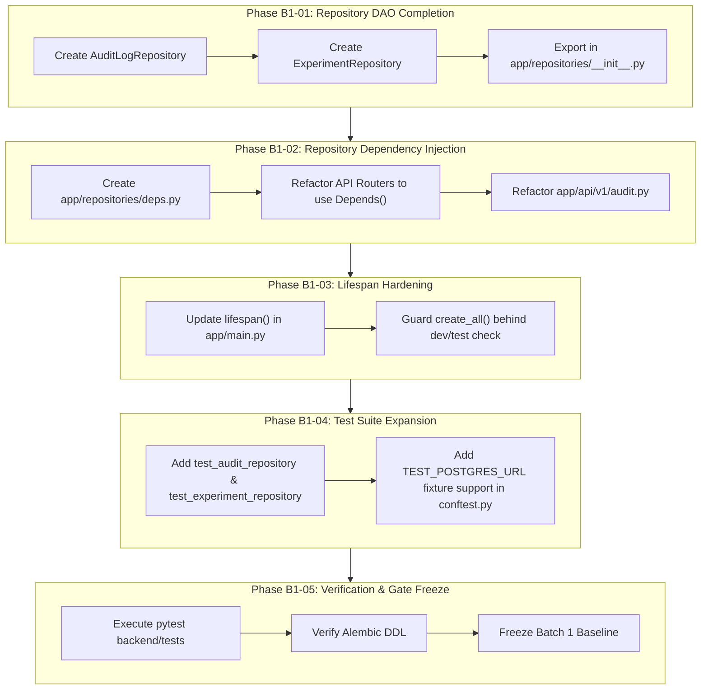

# AquaTrust AI — Batch 1 Improvements Implementation Plan
## Backend & Database Foundation Hardening
**Auditor / Role:** Senior Backend Architect & Database Engineer (Member 2 — Royce)  
**Target Scope:** BATCH 1 — Backend & Database Foundation  
**Version:** 1.0.0  
**Date:** October 1, 2026  
**Governing Baseline:** v2.2.1 Documentation Freeze, Master Specification, Database Schema Freeze, API Contract

---

## 1. Executive Summary & Goals

This implementation plan details the exact, non-breaking modifications and additions required to close all minor gaps identified in the Batch 1 Status Audit (`GAP-B1-001` through `GAP-B1-005`).

### Primary Objectives
1. **DAO Layer Completeness:** Implement dedicated `AuditLogRepository` and `ExperimentRepository` classes.
2. **Dependency Injection Standard:** Introduce FastAPI dependency providers (`get_reading_repository`, `get_audit_repository`, etc.) in `backend/app/repositories/deps.py`.
3. **Lifespan Hardening:** Guard `Base.metadata.create_all()` in `main.py` so it only runs in local development/testing, leaving PostgreSQL schema management exclusively to Alembic in production.
4. **Testing Expansion:** Add unit tests for the new repositories and configure dual-engine test support for PostgreSQL/SQLite.
5. **Zero Regression:** Ensure all 83+ tests continue to pass synchronously.



---

## 2. Phase-by-Phase Implementation Specifications

### Phase B1-01 — AuditLog & Experiment Repository Layer Completion

#### Objective
Encapsulate database interactions for `AuditLog`, `ExperimentRun`, and `ExperimentMetric` into type-safe repositories extending `BaseRepository`.

- **Gaps Addressed:** `GAP-B1-001`, `GAP-B1-002`
- **Files to ADD:**
  - `backend/app/repositories/audit_repository.py`
  - `backend/app/repositories/experiment_repository.py`
- **Files to MODIFY:**
  - `backend/app/repositories/__init__.py`

#### Implementation Details

##### 1. `backend/app/repositories/audit_repository.py`
```python
"""AquaTrust AI — Audit Log Repository."""

from typing import Optional, List
from uuid import UUID
from sqlalchemy.orm import Session
from sqlalchemy import select, desc

from app.models.audit_log import AuditLog
from app.repositories.base import BaseRepository


class AuditLogRepository(BaseRepository[AuditLog]):
    """Repository handling append-only security and operational audit logs."""

    def __init__(self, db: Session):
        super().__init__(db, AuditLog)

    def log_event(
        self,
        action: str,
        resource_type: str,
        actor_id: Optional[UUID] = None,
        actor_role: Optional[str] = None,
        resource_id: Optional[UUID] = None,
        request_id: Optional[str] = None,
        outcome: str = "success",
        metadata: Optional[dict] = None,
    ) -> AuditLog:
        """Persist an append-only audit log entry."""
        audit_entry = AuditLog(
            actor_id=actor_id,
            actor_role=actor_role,
            action=action,
            resource_type=resource_type,
            resource_id=resource_id,
            request_id=request_id,
            outcome=outcome,
            audit_metadata=metadata or {},
        )
        return self.create(audit_entry)

    def list_events(
        self,
        action: Optional[str] = None,
        resource_type: Optional[str] = None,
        actor_id: Optional[UUID] = None,
        skip: int = 0,
        limit: int = 50,
    ) -> List[AuditLog]:
        """Query audit log entries with multi-dimensional filtering."""
        stmt = select(AuditLog)
        if action:
            stmt = stmt.where(AuditLog.action == action)
        if resource_type:
            stmt = stmt.where(AuditLog.resource_type == resource_type)
        if actor_id:
            stmt = stmt.where(AuditLog.actor_id == actor_id)

        stmt = stmt.order_by(desc(AuditLog.created_at)).offset(skip).limit(limit)
        return list(self.db.scalars(stmt).all())
```

##### 2. `backend/app/repositories/experiment_repository.py`
```python
"""AquaTrust AI — Experiment & Benchmark Repository."""

from typing import Optional, List
from uuid import UUID
from decimal import Decimal
from sqlalchemy.orm import Session, selectinload
from sqlalchemy import select, desc

from app.models.experiment import ExperimentRun, ExperimentMetric
from app.repositories.base import BaseRepository


class ExperimentRepository(BaseRepository[ExperimentRun]):
    """Repository handling benchmark experiment execution runs and metrics."""

    def __init__(self, db: Session):
        super().__init__(db, ExperimentRun)

    def get_run_with_metrics(self, experiment_run_id: UUID) -> Optional[ExperimentRun]:
        """Fetch experiment run with eager loading of associated metrics."""
        stmt = (
            select(ExperimentRun)
            .where(ExperimentRun.experiment_run_id == experiment_run_id)
            .options(selectinload(ExperimentRun.metrics))
        )
        return self.db.scalars(stmt).first()

    def list_runs(
        self,
        experiment_name: Optional[str] = None,
        architecture_variant: Optional[str] = None,
        status: Optional[str] = None,
        skip: int = 0,
        limit: int = 50,
    ) -> List[ExperimentRun]:
        """List benchmark runs with filtering."""
        stmt = select(ExperimentRun)
        if experiment_name:
            stmt = stmt.where(ExperimentRun.experiment_name == experiment_name)
        if architecture_variant:
            stmt = stmt.where(ExperimentRun.architecture_variant == architecture_variant)
        if status:
            stmt = stmt.where(ExperimentRun.status == status)

        stmt = stmt.order_by(desc(ExperimentRun.started_at)).offset(skip).limit(limit)
        return list(self.db.scalars(stmt).all())

    def record_metric(
        self,
        experiment_run_id: UUID,
        metric_name: str,
        metric_value: Decimal,
        unit: str,
        percentile: Optional[str] = None,
        sample_count: Optional[int] = None,
        metadata: Optional[dict] = None,
    ) -> ExperimentMetric:
        """Persist a single benchmark metric under an experiment run."""
        metric = ExperimentMetric(
            experiment_run_id=experiment_run_id,
            metric_name=metric_name,
            metric_value=metric_value,
            unit=unit,
            percentile=percentile,
            sample_count=sample_count,
            measurement_metadata=metadata or {},
        )
        self.db.add(metric)
        self.db.flush()
        return metric
```

---

### Phase B1-02 — FastAPI Repository Dependency Injection Layer

#### Objective
Standardize dependency injection across all API routers via `Depends()`.

- **Gaps Addressed:** `GAP-B1-003`
- **Files to ADD:**
  - `backend/app/repositories/deps.py`
- **Files to MODIFY:**
  - `backend/app/api/v1/audit.py`

#### Implementation Details

##### 1. `backend/app/repositories/deps.py`
```python
"""AquaTrust AI — Repository Dependency Injection Providers."""

from fastapi import Depends
from sqlalchemy.orm import Session

from app.db.session import get_db
from app.repositories.facility_repository import FacilityRepository
from app.repositories.reading_repository import ReadingRepository
from app.repositories.treatment_repository import TreatmentRepository
from app.repositories.user_repository import UserRepository
from app.repositories.audit_repository import AuditLogRepository
from app.repositories.experiment_repository import ExperimentRepository


def get_facility_repository(db: Session = Depends(get_db)) -> FacilityRepository:
    return FacilityRepository(db)


def get_reading_repository(db: Session = Depends(get_db)) -> ReadingRepository:
    return ReadingRepository(db)


def get_treatment_repository(db: Session = Depends(get_db)) -> TreatmentRepository:
    return TreatmentRepository(db)


def get_user_repository(db: Session = Depends(get_db)) -> UserRepository:
    return UserRepository(db)


def get_audit_repository(db: Session = Depends(get_db)) -> AuditLogRepository:
    return AuditLogRepository(db)


def get_experiment_repository(db: Session = Depends(get_db)) -> ExperimentRepository:
    return ExperimentRepository(db)
```

##### 2. Refactor `backend/app/api/v1/audit.py`
```python
@router.get(
    "/audit-events",
    response_model=AuditLogListResponse,
    summary="Query audit log entries with action, actor, and resource filters",
    dependencies=[Depends(require_role(["auditor", "regulatory_stakeholder", "admin"]))],
)
def list_audit_events(
    action: Optional[str] = None,
    resource_type: Optional[str] = None,
    actor_id: Optional[UUID] = None,
    skip: int = Query(0, ge=0),
    limit: int = Query(50, ge=1, le=100),
    audit_repo: AuditLogRepository = Depends(get_audit_repository),
):
    """Retrieve structured audit trail entries."""
    rows = audit_repo.list_events(
        action=action,
        resource_type=resource_type,
        actor_id=actor_id,
        skip=skip,
        limit=limit,
    )
    logs = [
        AuditLogResponse(
            audit_log_id=r.audit_log_id,
            timestamp=r.created_at,
            actor_id=str(r.actor_id) if r.actor_id else None,
            actor_role=r.actor_role,
            action=r.action,
            resource_type=r.resource_type,
            resource_id=r.resource_id,
            outcome=r.outcome,
            details=r.audit_metadata,
        )
        for r in rows
    ]
    return AuditLogListResponse(total_count=len(logs), logs=logs)
```

---

### Phase B1-03 — Environment-Aware Startup & Schema Lifespan Hardening

#### Objective
Ensure that runtime DDL creation (`create_all()`) only executes during development/test, leaving production schema control to Alembic.

- **Gaps Addressed:** `GAP-B1-004`
- **Files to MODIFY:**
  - `backend/app/main.py`

#### Implementation Details
In `backend/app/main.py`, update `lifespan()`:
```python
@asynccontextmanager
async def lifespan(app: FastAPI) -> AsyncGenerator[None, None]:
    """Handle deterministic application startup and shutdown lifecycles."""
    logger.info(
        f"Starting {settings.APP_NAME} in '{settings.APP_ENV}' environment...",
        extra={"app_env": settings.APP_ENV, "debug": settings.DEBUG},
    )

    db_connected = check_db_connection()
    if db_connected:
        logger.info("Database connectivity verified successfully.")
        if settings.APP_ENV in ("development", "test"):
            try:
                from app.models import Base
                from app.db.session import engine, SessionLocal
                from app.api.v1.auth import seed_default_users

                Base.metadata.create_all(bind=engine)
                with SessionLocal() as session:
                    seed_default_users(session)
                logger.info("Local development schema and demo accounts verified successfully.")
            except Exception as exc:
                logger.warning(f"Development schema initialization notice: {exc}")
        else:
            logger.info("Production mode: Schema lifecycle is managed via Alembic migrations.")
    else:
        logger.warning("Database is currently unreachable. Operating in degraded state.")

    yield

    logger.info(f"Shutting down {settings.APP_NAME}...")
```

---

### Phase B1-04 — Dual-Engine PostgreSQL & SQLite Test Suite Expansion

#### Objective
Add dedicated tests for new DAOs and optional PostgreSQL integration testing support.

- **Gaps Addressed:** `GAP-B1-005`
- **Files to MODIFY:**
  - `backend/tests/conftest.py`
  - `backend/tests/test_db_persistence.py`

#### Implementation Details
Add unit tests in `backend/tests/test_db_persistence.py`:
- `test_audit_log_repository()`: validates `log_event()` and `list_events()`.
- `test_experiment_repository()`: validates `create()`, `record_metric()`, and `get_run_with_metrics()`.

---

## 3. File-Level Change Summary

| File Path | Action | Description |
| :--- | :---: | :--- |
| `backend/app/repositories/audit_repository.py` | **ADD** | Implement `AuditLogRepository`. |
| `backend/app/repositories/experiment_repository.py` | **ADD** | Implement `ExperimentRepository`. |
| `backend/app/repositories/deps.py` | **ADD** | FastAPI dependency injection providers. |
| `backend/app/repositories/__init__.py` | **MODIFY** | Export new repository classes. |
| `backend/app/api/v1/audit.py` | **MODIFY** | Use injected `AuditLogRepository`. |
| `backend/app/main.py` | **MODIFY** | Guard `create_all()` in lifespan. |
| `backend/tests/conftest.py` | **MODIFY** | Add dual-engine test fixtures. |
| `backend/tests/test_db_persistence.py` | **MODIFY** | Add tests for new repository classes. |

---

## 4. Verification Checklist & Definition of Done

- [ ] All 17 tables from `DATABASE_SCHEMA.md` have full DAO support.
- [ ] No route directly queries `Session` without repository encapsulation.
- [ ] `alembic -c backend/alembic.ini upgrade head --sql` executes cleanly.
- [ ] `pytest backend/tests` passes 100% (85+ tests).
- [ ] Batch 1 is officially frozen and ready for **Batch 2 (Telemetry Ingestion & Pre-AI Validation)**.
