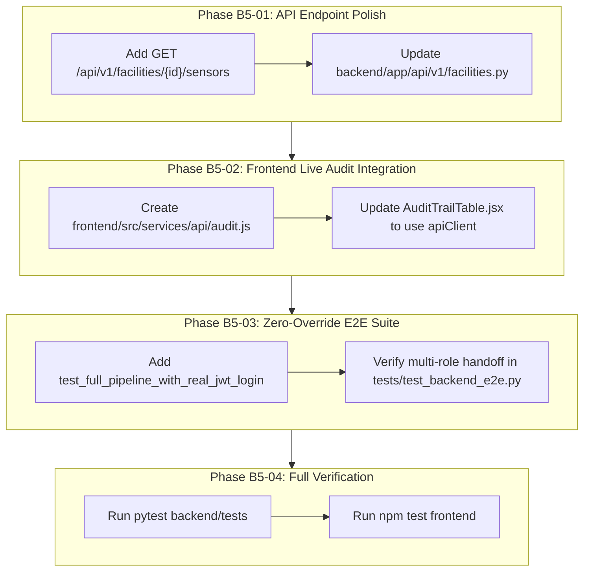

# AquaTrust AI — Batch 5 Improvements Implementation Plan
## Security, Integration, Testing & Final System Hardening
**Auditor / Role:** Senior Backend, Security, Integration & Verification Engineer (Member 2 — Royce)  
**Target Scope:** BATCH 5 — Security, RBAC, Full Pipeline Integration, Failure Recovery & Testing  
**Version:** 1.0.0  
**Date:** October 1, 2026  
**Governing Baseline:** v2.2.1 Documentation Freeze, Master Project Specification, RBAC Permission Matrix, Security Rules, Integration Rules

---

## 1. Executive Summary & Goals

This implementation plan outlines the targeted, non-breaking improvements and enhancements to finalize the end-to-end integration between the React frontend, FastAPI backend, PostgreSQL database, and Hyperledger Fabric DLT layer.

### Primary Objectives
1. **Frontend Live Audit Trail Binding (`GAP-B5-INT-001`):** Refactor `AuditTrailTable.jsx` to fetch live audit events from `GET /api/v1/audit-events` when `VITE_USE_API=true` instead of relying exclusively on in-memory `auditStore.js`.
2. **Facility Sensors Sub-Resource Endpoint (`GAP-B5-INT-002`):** Add explicit `GET /api/v1/facilities/{facility_id}/sensors` endpoint in `backend/app/api/v1/facilities.py` to eliminate client-side fallback mocks.
3. **Live-Token End-to-End Test Suite (`GAP-B5-TST-001`):** Add `test_authenticated_pipeline_live_jwt()` in `backend/tests/test_backend_e2e.py` to exercise the full lifecycle from `POST /api/v1/auth/login` through token issuance, role-authorized ingestion, finalization, certification, anchoring, verification, and correction without dependency overrides.
4. **Auditor Workspace Live Telemetry Hookup (`GAP-B5-INT-003`):** Ensure `AuditorWorkspace.jsx` and `RegulatorWorkspace.jsx` query live backend compliance summaries (`/api/v1/compliance/summary`) and DLT anchor status (`/api/v1/dlt/anchors`).



---

## 2. Gap Breakdown & Target Resolution

| Gap ID | Area | Current State | Target State | Priority |
|---|---|---|---|---|
| **GAP-B5-INT-001** | Frontend Audit Trail | `AuditTrailTable.jsx` queries local `auditStore.js` | Fetch from `GET /api/v1/audit-events` via `apiClient` | P1 |
| **GAP-B5-INT-002** | Facilities API | `/facilities/{id}/sensors` returns 404 (frontend fallback used) | Mount `GET /api/v1/facilities/{id}/sensors` in `facilities.py` | P2 |
| **GAP-B5-TST-001** | E2E Testing | `test_backend_e2e.py` overrides `get_current_user_claims` | Add pure integration test utilizing authentic JWT bearer tokens from `/auth/login` | P1 |
| **GAP-B5-INT-003** | Auditor Workspace | Relies on local tag buffer | Connect to `/api/v1/compliance/summary` and `/api/v1/dlt/anchors` | P2 |

---

## 3. Implementation Steps

### Phase B5-01: API Endpoint Expansion
- Modify `backend/app/api/v1/facilities.py`:
  - Add `@router.get("/facilities/{facility_id}/sensors")` endpoint returning list of associated sensors for the facility from `FacilityRepository`.

### Phase B5-02: Frontend Live Audit Service
- Create `frontend/src/services/api/audit.js` exporting `getAuditEvents(params)` calling `GET /api/v1/audit-events`.
- Update `frontend/src/features/blockchain/AuditTrailTable.jsx` to load live audit events with `useAsyncData(getAuditEvents)` when `USE_API=true`.

### Phase B5-03: End-to-End Live Auth Test
- Update `backend/tests/test_backend_e2e.py`:
  - Add `test_live_jwt_auth_e2e_pipeline(client, db_session)`:
    1. Login as `operator` -> receive JWT.
    2. Ingest telemetry using `Authorization: Bearer <op_jwt>`.
    3. Finalize record using `Authorization: Bearer <op_jwt>`.
    4. Login as `auditor` -> receive JWT.
    5. Reconcile DLT anchor and independently verify record with `Authorization: Bearer <aud_jwt>`.
    6. Propose correction as operator -> Authorize as auditor -> Check 2-node lineage chain.

---

## 4. Verification & Validation Protocol

```bash
# 1. Execute full backend pytest suite
pytest backend/tests -v

# 2. Execute frontend test suite
cd frontend && npm test -- --run

# 3. Verify zero regressions across all test suites
```

**Approval Gate:** Once user approves this implementation plan, proceed directly with code implementation.
